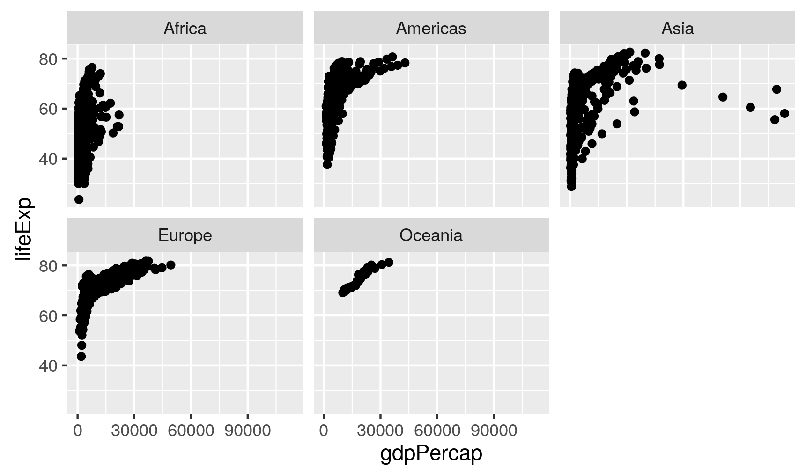

This is text.
*this is italics*
**this is bold**

You need an extra return to make a new paragraph.

# This makes a header

## Smaller header

### Even smaller header

---------------------------------------------------

This creates a divider 


To make lists

* item 1
* item 2
* item 3

To make an ordered list

1. item 1
2. item 2
3. item 3

[This is the link text](http://google.ca)





```{r this is the name of a chunk}
4 + 5
a <- 5678
```

kjlkgjdlkfjgdfl
lkfgjldkjgl

kdfjlgkdfjl

```{r}
print(a)
data <- data.frame(letters = c("a", "b", "c"),
                   numbers = c(1, 2, 3))
knitr::kable(data)

```

And this is how we do a plot

```{r, echo=FALSE}
library(gapminder)
library(ggplot2)
ggplot(gapminder, aes(x = continent, y = lifeExp)) + geom_jitter()

```

